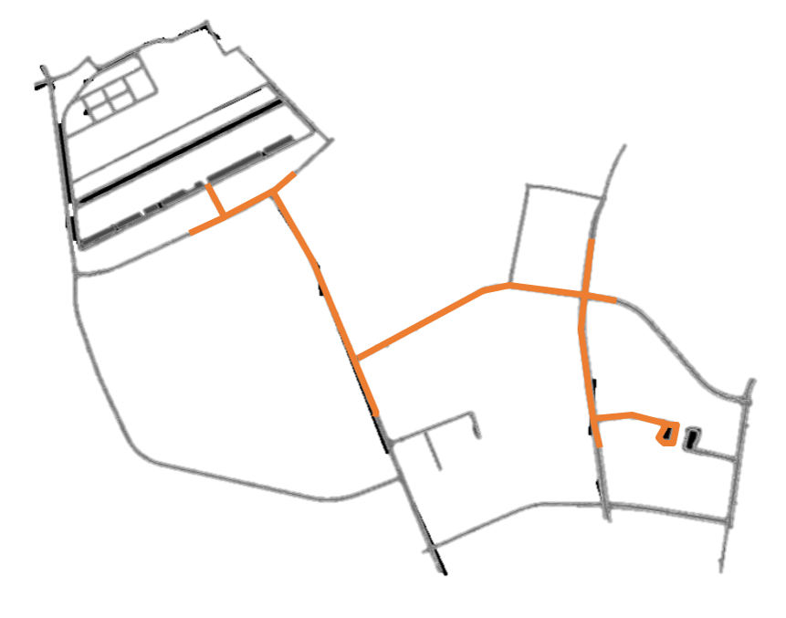
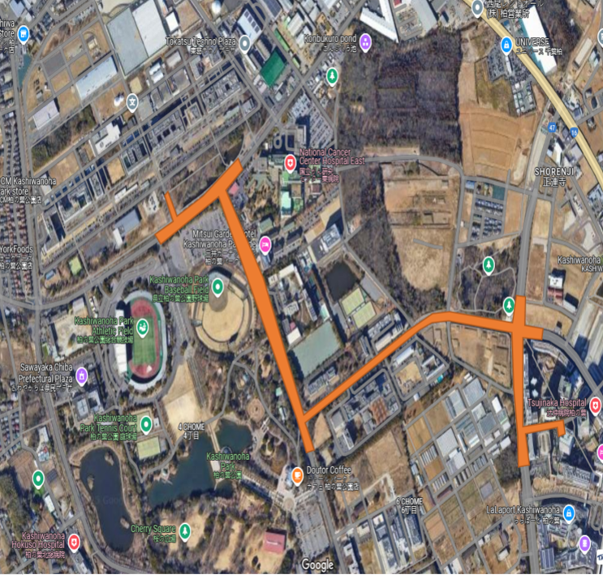
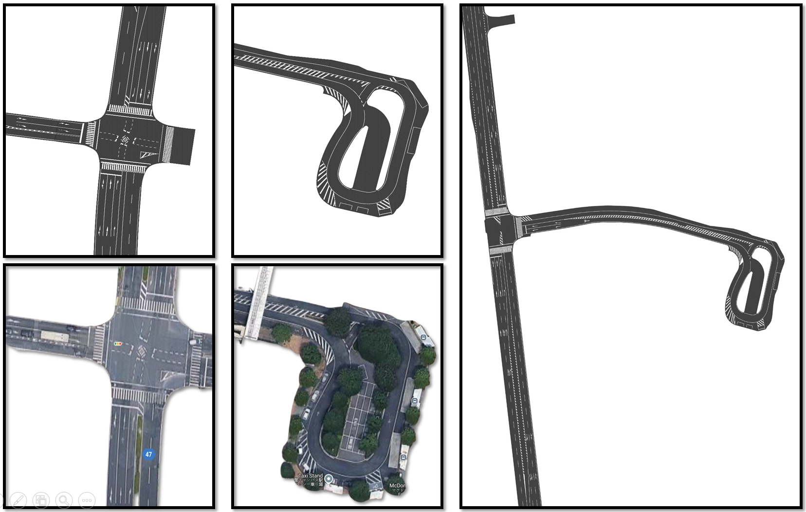
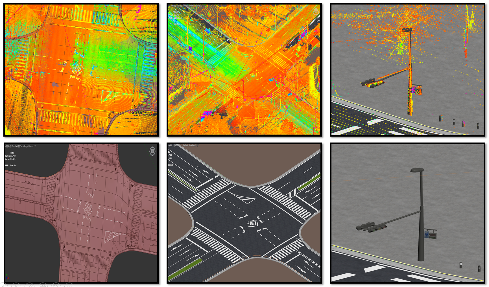
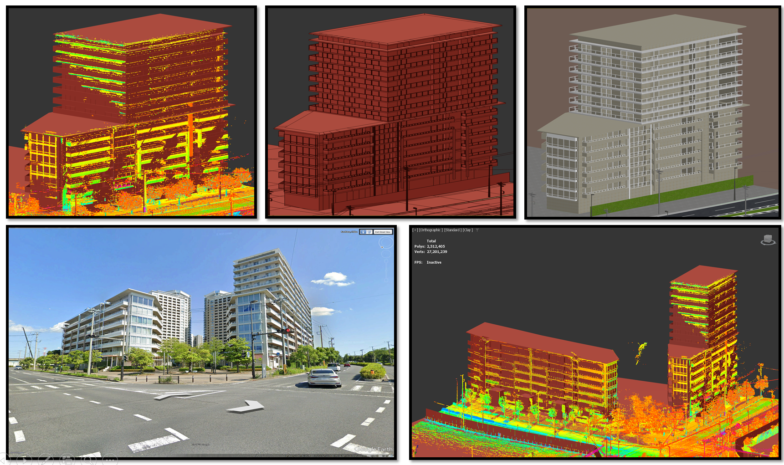
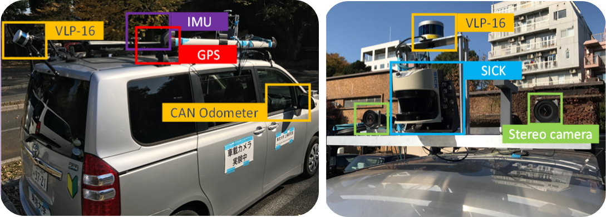

# Awsim Scenes

The primary test environment for Simple-AV is based on **Kashiwa, Tokyo**. We have focused on creating a highly accurate and realistic digital twin of a significant route in this area. The goal is to develop a simulation environment that accurately mirrors the real-world conditions, making it ideal for testing and validating autonomous driving algorithms.

---

## Main Route

Our main focus has been on building an environment that covers an important route within Kashiwa. The design process involves accurately recreating the ground, road lines, and every detail along the path, such as trees, vegetation, buildings, and other urban elements. 

We aim to achieve a high level of precision and realism to ensure that simulation results closely reflect real-world conditions. Below is an image of the main route we are working on highlighted in orange:

    
    

---

## Environment Design

To create a realistic and detailed environment, we are carefully modeling each element of the route. This includes 3D designing the ground, road markings, signs, roadside objects, trees, vegetation, and buildings. Every element is positioned precisely to match the real-world layout.

The following media showcase some aspects of our environment design:

  
  
  
 
<video width="1920" controls autoplay muted loop>
    <source src="3DdesignVideo.mp4" type="video/mp4">
</video>
---

## High-Precision PCD Data

To ensure the accuracy of our digital twin, we have captured a highly detailed **Point Cloud Data (PCD)** of the entire Kashiwa area. This PCD data serves as the basis for accurately designing the simulation environment. 

The use of PCD data is crucial as it allows us to match the real-world topography and object placements with high fidelity. Below are some snapshots and videos from the PCD capture process:

    
    <video width="300" controls autoplay muted loop>
        <source src="capturingPcdVideo1.mp4" type="video/mp4">
    </video>

<video width="1920" controls autoplay muted loop>
    <source src="capturingPcdVideo2.mp4" type="video/mp4">
</video> 

---

By utilizing this data and meticulous 3D modeling, we are developing a realistic and precise AWSIM environment that can support accurate autonomous vehicle testing and validation. Stay tuned as we continue to enhance this digital twin to support a wide range of scenarios and experiments.

---

## Technical Aspects of the Simulator

Creating a realistic 3D environment is just one part of building an effective autonomous vehicle simulator. The other crucial aspect is the technical integration and simulation management. For this purpose, we leverage the **AWSIM** project, an open-source initiative by **Tier-IV**, the same team behind **Autoware**.

AWSIM, originally designed for the **Shinjuku, Tokyo** scene, is tightly coupled with Autoware’s message standards. However, our simulation environment in **Kashiwa** requires modifications to AWSIM to make it compatible with our custom message standard, **DM**. We have extended AWSIM’s capabilities to support our message format and tailored it to seamlessly work with our new Kashiwa scene.

Furthermore, AWSIM's original vehicle model is a **Lexus RX450H**, but to diversify our testing scenarios, we have also integrated a **bus model** into the simulation. This allows for more comprehensive testing of different vehicle types and configurations.

Here are the available AWSIM scenes and vehicle models:

- **Shinjuku, Tokyo Scene:** [Download here](shinjuku_link)
- **Kashiwa, Tokyo Scene - Lexus Model:** [Download here](https://drive.google.com/drive/folders/1GCXG6S2MeOMjNjEbMUlYO2JOUidEjU7R?usp=drive_link)
- **Kashiwa, Tokyo Scene - Bus Model:** [Download here](https://drive.google.com/drive/folders/10Y8swA4Zfuh_U34EDGDr4i4As6Yidrfr?usp=drive_link)

By combining accurate 3D environments with technical enhancements to AWSIM, we create a highly realistic and flexible simulation platform suitable for testing various autonomous driving scenarios.

