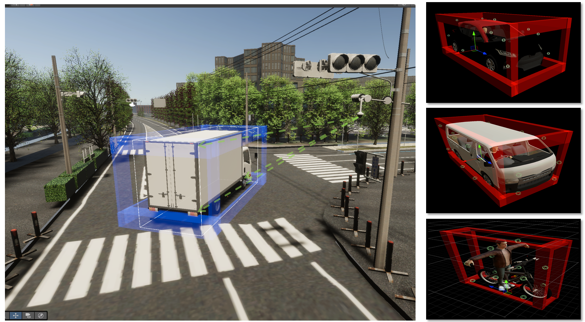

# Road Side Units (RSU) in Simple-AV

In the Simple-AV project, **Road Side Units (RSUs)** play a crucial role in the **V2X (Vehicle-to-Everything)** communication setup. These units are strategically placed at intersections to enhance the detection coverage and reduce blind spots, creating a **smart infrastructure** within the simulation environment.

## RSUs as Pseudo Sensors

One of the key innovations we implemented in our **V2X_E2E** project is the integration of RSUs as **Pseudo Sensors**. Unlike traditional sensors that use point cloud data (PCD) and perform heavy object detection pipelines, pseudo sensors aim to significantly **reduce the computational load** while maintaining detection accuracy.

### How Pseudo Sensors Work

Instead of using complex object detection algorithms or raw PCD from LiDARs, pseudo sensors operate based on **assigned points** on objects. 

- When we create objects like vehicles or pedestrians in the simulation, we assign a specific number of **detection points** to their physical model. 
- The number of points is proportional to the object's size. For instance:
  - A **truck** may have around **30 points**.
  - A **pedestrian** may have **10 points**.

The pseudo sensor then **radiates rays** in the environment, and if the rays hit enough points on an object (exceeding a predefined **detection threshold**), the sensor considers the object **detected**. 

For example:
- If a truck passes through the intersection and the sensor detects at least **10 points** on it, the object is marked as detected.
- Once detected, the sensor publishes detailed information about the object, including:
  - **Position**
  - **Rotation**
  - **Linear Speed**
  - **Type** (e.g., pedestrian, car, truck)

### Advantages of Pseudo Sensors

- **Low Computation Cost:** Avoids the need for real-time LiDAR point cloud processing or complex object detection algorithms.
- **Efficient Detection:** Suitable for intersections where real-time data from multiple objects is crucial.
- **Smart Infrastructure:** Enables the simulation of smart intersections with enhanced V2X capabilities.

## Creating a Smart Intersection

We use pseudo sensors to build a setup of RSUs at each intersection, forming a **smart infrastructure**. This setup allows us to:
- **Test sensor placements** to maximize intersection coverage.
- **Minimize blind spots** by strategically positioning RSUs.
- **Study the impact** of smart infrastructure on traffic safety and efficiency.

### Example of Object with Detection Points

Here are some examples of objects with assigned detection points:

--- 

By leveraging RSUs as pseudo sensors, we create a **more efficient and realistic V2X simulation** that is computationally lightweight while still providing accurate detection at intersections.
