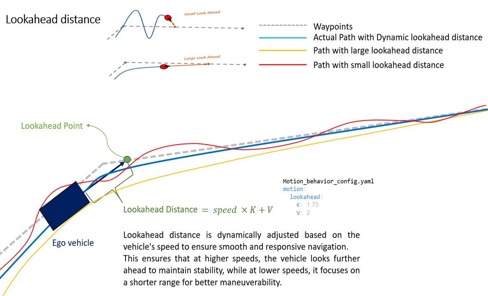
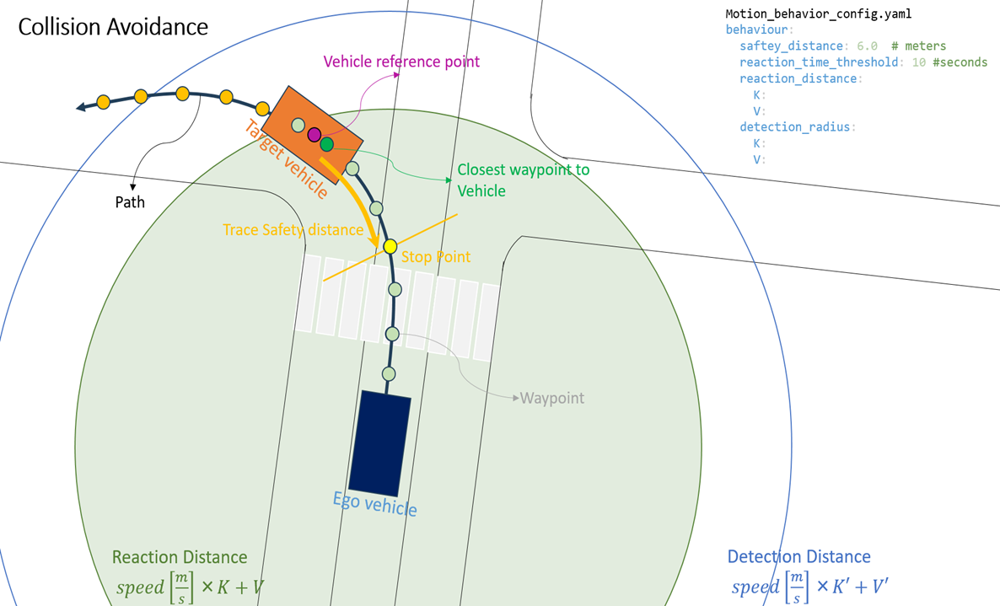
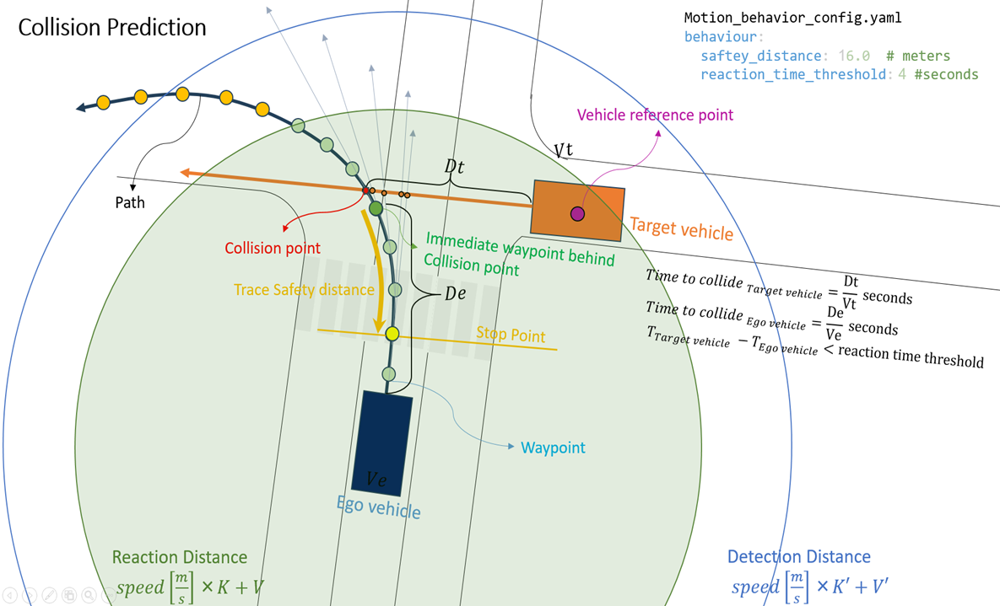
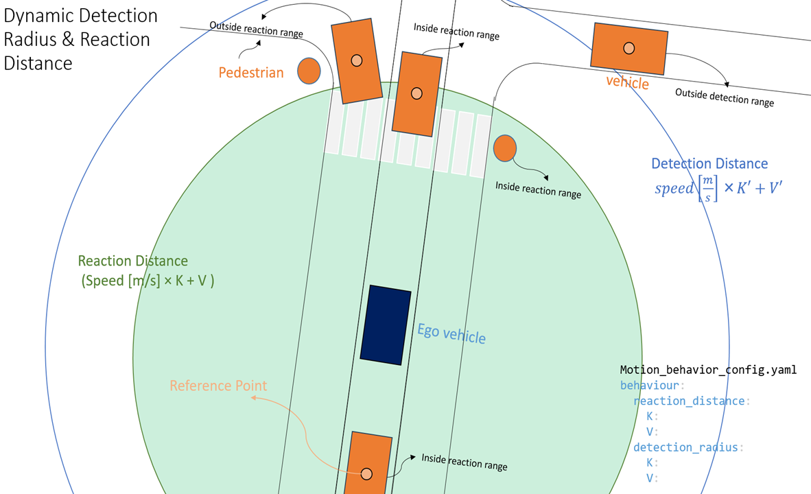

# Planning Module

The Planning module in simple-AV is responsible for generating safe and feasible trajectories for the autonomous vehicle. This module utilizes data from the Localization and Perception modules to plan a path that ensures the vehicle navigates effectively while adhering to traffic rules and road conditions. It is composed of multiple nodes, each with a specific role in mission-level path planning, behavioral decisions, and motion-level planning. The planned trajectory is then executed by the Control module to move the vehicle along the desired path.

The Planning module is designed to integrate seamlessly with other modules in the simple-AV architecture. It receives input from the Localization and Perception modules and sends its output to the Control module. This integration ensures that the vehicle can navigate effectively in a dynamic environment while maintaining safety and efficiency.

By utilizing data from multiple sources and employing sophisticated planning algorithms, the Planning module plays a crucial role in the autonomous operation of the vehicle, ensuring that it can navigate complex environments and respond to changing conditions in real-time.

## Overview

The Planning module operates in three main stages:

1. **Mission Planning** – Computes the global route through the city map from source to destination.
2. **Behavior Path Planning** – Selects the immediate goal point and speed limits along the global path.
3. **Behavior Motion Planning** – Makes final decisions on motion-level planning based on perception data, including obstacles and traffic lights.

Each node operates independently but communicates through defined topics and services to ensure coordination and modularity.

## Mission Planning

**Purpose:**  
Generates the high-level global path for the vehicle using a graph search algorithm.

**Inputs:**

- **Map**: The full lanelet map of the city.
- **Start Lanelet**: Received from the Localization module.
- **Destination**: Defined in the `scenario_config` file.

**Functionality:**

- Implements Breadth-First Search (BFS) to compute the shortest route (as a sequence of lanelets) between the start and destination.
- Acts as a **ROS service** that gets triggered by the `behavior_path_planning` node using `/planning/trigger_mission_plan` topic.
- When triggered, the node runs the algorithm and publishes the output on `simple_av/planning/mission_plan` topic.

**Outputs:**

Publishes the path as

- A sequence of **waypoints**.
- A sequence of **lanelets** representing the route.

## behavior_path_planning

The `behavior_path_planning` node is responsible for real-time trajectory planning by selecting suitable look-ahead points on the global path and assigning appropriate speed limits for the vehicle. This node continuously determines a **look-ahead point**, which serves as a dynamic target point on the path ahead of the vehicle. This is used by the downstream motion planning and control modules.

Behavior path planning also Calculates the `speed limit` based on Upcoming turns.

This node Subscribes to the `simple_av/planning/mission_plan` published by the `mission_planning` node. A client also implemented in this node to request `mission_plan` from mission_planning node when its needed.

## behavior_motion_planning

The `behavior_motion_planning` node is responsible for making the vehicle responsive to dynamic elements in the environment, such as obstacles and traffic lights. It adjusts the planned motion accordingly to ensure safe and lawful driving behavior. The node receives **detected objects** from the `objectDetectionHandler` node and **traffic signal status** from the `trafficLightHandler` node in the Perception module.

By bridging the gap between perception and planning, `behavior_motion_planning` ensures that the vehicle is continuously aware of its surroundings and that the motion plan is updated in real-time. This allows the vehicle to react appropriately to red lights, stop signs, and dynamic obstacles, maintaining safety and regulatory compliance.

This node performs three key responsibilities:

---

#### 1. Handling Traffic Lights

The node checks for traffic lights on the vehicle’s path using map data and planned waypoints. If a traffic light is detected and its status (provided by the Perception module) is **yellow** or **red**, the node generates a **stop point** at the corresponding stop line. This stop point is published for use by the control node, allowing the vehicle to stop smoothly and legally.

---

#### 2. Obstacle Detection and Stop Point Calculation

If an obstacle such as a pedestrian or vehicle is detected within the path, the node calculates a **safe stop point** before reaching it. This ensures the vehicle can come to a halt in time and avoid potential collisions.

---

#### 3. Collision Prediction

The node actively predicts potential collisions by using its knowledge of:
- The ego vehicle’s current pose and planned path,
- Surrounding objects’ positions and velocities (from the Perception module).

If a collision is predicted — for example, if another vehicle is on a collision course — the node selects a **stop waypoint** behind the predicted collision point to prevent impact.

---

#### Detection and Reaction Radius

Both **collision avoidance** and **collision prediction** mechanisms rely on two configurable zones:

- **Detection Radius**: The area within which surrounding objects are monitored.
- **Reaction Radius**: The smaller area where immediate decisions (e.g., braking) are triggered if an object poses a collision risk.

These radii are **dynamically adjusted based on the vehicle’s speed** — higher speeds increase both the detection and reaction distances, ensuring the vehicle has enough time and space to respond safely in all conditions.

Together, these three capabilities make the `behavior_motion_planning` node a critical component for safe and intelligent vehicle behavior in dynamic environments.

#### motion planning msg type

- **Stop Point:** The point where the vehicle should stop.
- **Status:** A string indicating the vehicle's current action, such as:
    - `Cruise`: The vehicle should continue moving.
    - `Decelerate`: The vehicle should slow down.
    - `Turn`: The vehicle should make a turn.
    - `red_stop` or `amber_stop`: The traffic light is red or amber, and the vehicle must slow down and stop at the stop point.
    - `green_cruise`: The traffic light is green, and the vehicle should continue moving.
    - `Park`: The vehicle must stop completely.

