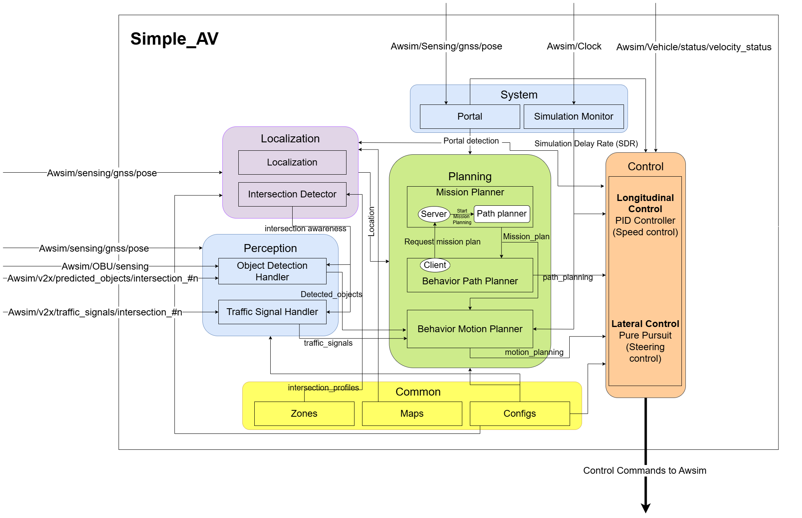

# Welcome to Simple AV project

simple-AV is an open-source software stack for self-driving vehicles, built on the [Robot Operating System (ROS)](https://www.ros.org/). simple-AV is written using Python, designed to facilitate autonomous vehicle simulation by <b>directly connecting to AWSIM and replacing the [Autoware](https://autoware.org/) framework</b>. It was created to provide a comprehensive framework for developing and testing autonomous vehicle systems.

## How it looks

<video width="1920" controls autoplay muted loop>
    <source src="trailer.mp4" type="video/mp4">
</video>

The primary purpose of **simple-AV** is to ease the simulation and development of self-driving technologies by providing a robust, flexible, and easy-to-understand platform. **simple-AV** includes all of the necessary functions to drive an autonomous vehicle, from localization and object detection to route planning and control.

While **Autoware** is a comprehensive and powerful project that handles everything related to autonomous driving, it naturally comes with significant computational demands. Autonomous driving is a complex and safety-critical task, so Autoware's software is understandably large and intricate. Developing or adding features to Autoware can be challenging, requiring a deep understanding of its codebase and substantial hardware resources.

**simple-AV** is designed as an alternative solution for simpler tasks and straightforward development. It is lightweight and efficient, making it ideal for scenarios like testing a specific scenario repeatedly or rapidly prototyping a new feature. Unlike Autoware, **simple-AV** is more accessible to developers due to its lower computational requirements and simplified architecture.

While it is good practice to use and extend Autoware when possible, the complexity and hardware demands make it less suitable for quick experiments or lightweight applications. In contrast, **simple-AV** is an excellent option for developers who need a more manageable and adaptable platform, allowing them to modify and extend it as needed with minimal setup.

#### Using AWSIM with simple-AV?

Simple-AV can be utilized with AWSIM for several key reasons. Firstly, simulators such as AWSIM provide a cost-effective and secure environment for testing and refining autonomous driving algorithms before they are implemented in real vehicles. Using simple-AV with a simulator allows developers to assess and adjust their algorithms without the risk of real-world accidents or damage. 

Furthermore, simulators allow developers to replicate complex driving scenarios, including challenging conditions or rare events, which are difficult to reproduce in real-world testing with high accuracy. The compatibility of simple-AV with AWSIM ensures smooth integration between the software and the simulated vehicle, enabling thorough testing and validation of autonomous driving functions. By employing a simulator, simple-AV can be rigorously tested in a variety of scenarios to confirm its robustness and reliability.

!!! note "Connection with simple-AV"
    Introduction about how the connection between AWSIM and simple-AV works can be read [here](Simple-AV/CommunicatingWithAWSIM/index.md).

## Simple-AV: Modular Architecture

[Open Diagram in Full Screen](arch-V7.html){target=_blank}

In terms of architecture, **simple-AV** adopts a modular approach. It is composed of several independent modules that interact through **ROS2**. This modular design allows users to choose and integrate various modules according to their specific needs and requirements. The software stack includes several key components, such as **Perception**, **Localization**, **Planning**, **Control**, **Common**, and **System** modules, as well as the **AWSIM** environment. 

Here’s a brief overview of each module:

- **AWSIM** - Simple-AV uses **AWSIM** as its simulation environment to acquire data. This simulator provides sensor data from mounted sensors on the vehicle, such as *LiDARs*, *Cameras*, and *GNSS*. These data are then processed and utilized by other modules to perform perception, localization, planning, and control. More details [here](Simple-AV/AWSIM/index.md).

- **Perception** - Uses data from AWSIM sensors and RSUs to detect surrounding objects, vehicles, pedestrians, and traffic signals. The Perception module then processes this data to determine the position, type, and status of objects and traffic lights. More details [here](Simple-AV/Modules/Perception/index.md).

- **Localization** - Uses the GNSS data provided by AWSIM to accurately determine the vehicle's position and orientation within the environment. It also uses map data to determine the closest lane and waypoint. Additionally, the **intersection_detector** node in this module identifies which intersection the vehicle is near, entering, or exiting. More details [here](Simple-AV/Modules/Localization/index.md).

- **Planning** - Generates a safe and feasible trajectory for the autonomous vehicle based on the data gathered from the **Perception** and **Localization** modules. It also incorporates map data and traffic rules to create optimal paths. More details [here](Simple-AV/Modules/Path_planning/index.md).

- **Control** - Executes the planned trajectory by sending commands to the vehicle's actuators, such as steering, throttle, and braking. The control module ensures that the vehicle follows the desired trajectory while maintaining safety and stability. More details [here](Simple-AV/Modules/Control/index.md).

- **Common** - A shared resource module that stores configuration files, maps, and zone data used by other modules. The **[Maps](Simple-AV/JsonMap/index.md)** folder contains map data in JSON format, the **configs** folder contains various configuration files, and the **zones** folder holds metadata like intersection profiles. More details [here](Simple-AV/Modules/Common/index.md).

- **System** - This module includes nodes that monitor the simulation environment and manage scenario repetitions. The **sim_monitor** node calculates the simulation delay rate, while the **portal** node detects when the vehicle teleports (passes through a portal) and signals other modules to reset their states. More details [here](Simple-AV/Modules/System/index.md).
